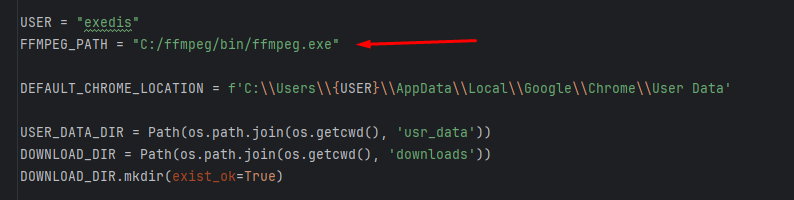
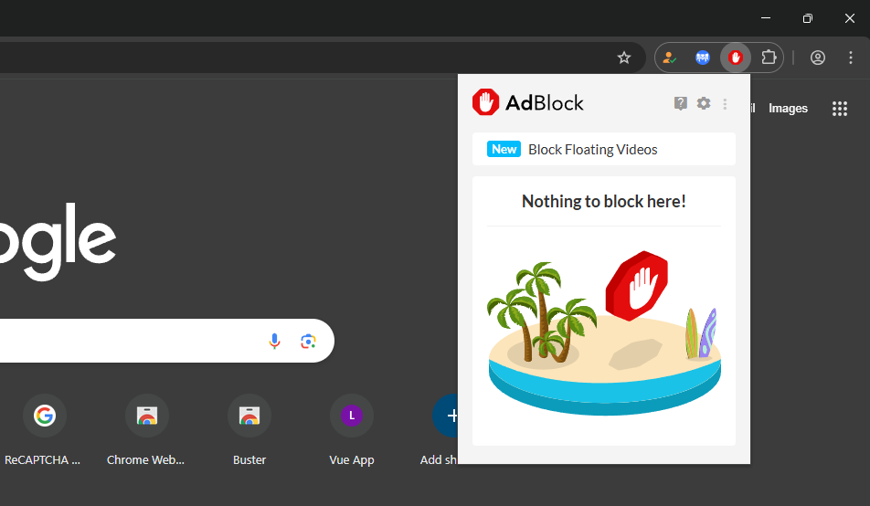
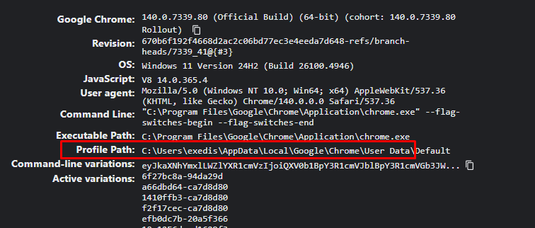

```bash
pip install -r .\requirements.txt
```
You will also need to install ffmpeg and specify the bin folder location in `config.py` - https://github.com/BtbN/FFmpeg-Builds/releases


Add the following adblocker to bypass tokybook ads. Just install it to your chrome browser - https://chromewebstore.google.com/detail/adblock-%E2%80%94-block-ads-acros/gighmmpiobklfepjocnamgkkbiglidom


Make sure that you `User Data` is indeed the folder that your chrome profile is in. 
You can find it by going to `chrome://version/` in your browser and looking for `Profile Path`.
Copy everything before `Default` and paste it in `config.py`.
